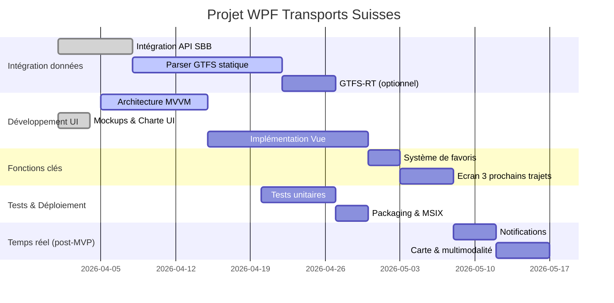

# Synthèse exécutive

Nous proposons une application WPF *fluent* en français, affichant en temps réel (ou quasi temps réel) les prochains départs de transport public suisses. Elle s’appuie sur les APIs **SBB Swiss Mobility** (pour les données temps réel et planifiées) et sur les jeux de données **GTFS statiques/GTFS-RT** fournis par la plateforme [opentransportdata.swiss](https://opentransportdata.swiss)【6†L1-L3】【36†L0-L3】. Au lancement, l’app affiche les *“3 prochains bus”* favoris de l’utilisateur (basé sur ses lignes/arrêts préférés). Le rapport détaille : fonctionnalités (imposées et optionnelles), UX design moderne (mockups, palette couleur, animations…), schémas MVVM pour WPF, architecture services (APIs, cache, mode offline, rafraîchissement), gestion des clés API, tests, packaging MSIX et mise à jour, ainsi qu’un plan de projet (jalons, backlog priorisé). Des exemples concrets de code C# (HttpClient, JSON, parsing GTFS/GTFS-RT, XAML moderne) et des diagrammes mermaid (architecture et planning) illustrent la solution. 

# 1. Fonctionnalités clés

**Fonctionnalités «must-have»** :
- **Recherche et favoris** : l’utilisateur saisit un arrêt ou numéro de ligne (autocomplete avec API location/stopSearch). Possibilité d’enregistrer plusieurs arrêts/lignes favoris. 
- **Affichage en temps réel** : à chaque arrêt ou ligne sélectionné(e), affichage de la liste des prochains départs (les 3 suivants au minimum), avec horaires prévus/actualisés【120†】. Utiliser SBB API *StationBoard* (ou *Trip*/ *Journey* API) pour obtenir les départs temps réel, ou en alternatif la [Transport API](https://transport.opendata.ch)【90†L1-L4】.
- **Mode offline / cache** : si aucune connexion, basculer sur GTFS statique (délai maximal). Stocker localement les GTFS (fichiers CSV) pour pourvoir calculer les départs hors-ligne jusqu’à 48 h. Des mises à jour en tâche de fond (via `Timer` ou `Task`) rafraîchissent le cache quotidiennement【120†】.
- **Notifications (optionnel)** : notifications Windows pour alerte retard/départ imminent sur favoris. Paramétrable (ex. 5 min avant).
- **Multilingue (FR)** : interface en français par défaut (Strings resx pour localisation). 

**Fonctionnalités «nice-to-have»** :
- **Cartographie** : intégration d’une carte (Bing Maps/Leaflet dans WebView) affichant arrêts et trajet entre deux arrêts【26†】. 
- **Trajets multimodaux** : suggérer itinéraires multimodaux (SBB API *Journey*).
- **Dark mode** : thème clair/sombre (réactif à l’option système)【100†L1-L3】.
- **Accessibilité** : navigation clavier, texte de contraste élevé, taille de police ajustable.
- **Widget / live-tile** : vignette Windows 10/11 résumé (éventuellement).

> **Affichage “3 prochains bus”**: À l’ouverture, l’app peut proposer un écran d’accueil présentant les trois prochains départs des lignes/arrêts favoris. Par exemple, une carte en en-tête puis trois cartes ou listes déroulantes pour chaque arrêt, affichant l’heure théorique, éventuel retard (ex. +2 min), numéro de ligne, direction et un indicateur d’affluence. Cela répond à l’usage rapide : l’utilisateur voit immédiatement ses prochains trajets【36†L0-L7】. 

# 2. Concepts UX et design

- **Thème moderne & Fluent** : Utiliser les **fluent styles** récents (WPF .NET 9+ intègre un nouveau thème Fluent Windows 11【100†L1-L3】). Contrôles arrondis, animations légères (ex. survol de bouton, transitions de pages). Palette sobre : couleurs inspirées de la charte SBB (rouge #EE1C25, gris/bleu clair pour fonds) ou Fluent Acrylic translucide pour le header. 
- **Typographie** : Police sans-sérif moderne (ex. *Segoe UI*, *Open Sans* ou *Microsoft Sans Serif*), lisible même petit. Tailles hiérarchisées (12–18 pt). Grande taille horaire pour lisibilité.
- **Mise en page** : Barre latérale ou hamburger menu pour navigation (préférences, favoris, à propos). Accueil divisé en tuiles pour chaque arrêt favori. 
- **Mockups** : Par exemple, page principale : Header flottant (logo SBB, nom appli), corps avec cartes pour arrêts favori – chacune présente un bandeau rouge en haut (ligne + direction), liste d’horaires dessous. Animations : sur glisser-déposer pour réordonner favoris, effets de hover.
- **Couleurs & Iconographie** : Palette harmonieuse (blanc, gris clair, bleu SBB, rouge accent), icônes glyphes (bus, train, alertes) claires. Indicateurs visuels pour retards (ex. texte rouge ou icône “!”).
- **UX “3 prochains bus”** : Écran de démarrage optionnel demandant de définir 3 arrêts/lignes préférés. Ensuite, carousel/diaporama ou pilule horizontale montrant les 3 départs.

# 3. Architecture technique

Nous adoptons **MVVM** (Model-View-ViewModel) pour WPF【82†L0-L3】 : chaque vue (XAML) bind à un ViewModel, qui expose ObservableCollection de modèles (Stop, Departure...). Les modèles encapsulent données GTFS/SBB. Ex : classes `Stop`, `Journey`, `Departure`. 

**Components** :
- **Services** : 
  - *ApiService* : appelle les APIs REST (SBB) via `HttpClient` et `JsonSerializer`【36†L0-L7】. Gestion des clés (en TLS), header Authentication. Implémente méthode `GetStationBoard(stopId)` retournant liste de départs JSON.
  - *GtfsService* : télécharge le ZIP GTFS de opentransportdata (via CKAN API)【35†L0-L7】, unzippe et charge CSV dans SQLite ou en mémoire. Parse les fichiers (agency.txt, stops.txt, stop_times.txt...). 
  - *GtfsRtService* (optionnel) : consomme flux GTFS-RT (protobuf via `.proto` ou JSON si disponible) pour temps réel (positions, delays).
  - *Cache/DB* : SQLite local (ou LiteDB) stocke GTFS statique et favoris. Abstraction *IDataCache*.
  - *OfflineService* : choisit source GTFS statique si pas d’Internet, et synchronise en fond (Timer – tache planifiée).
- **MVVM Structure** :
  - **Models** : `Stop`, `Line`, `Departure` (ligne, heure, statut), `Favorite` (user stop/line).
  - **ViewModels** : e.g. `MainViewModel` avec liste de `FavoriteViewModel`, `DepartureViewModel` ; `SettingsViewModel`, etc. Ils contiennent `ICommand` pour actions (rafraîchir, ajouter favori).
  - **Views** : XAML Pages/UserControls. Exemples : `MainView.xaml`, `FavoriteItemControl.xaml`.
- **Communication** : `MainViewModel` utilise *data binding* à `ObservableCollection<Departure>` pour mettre à jour l’UI dès données chargées.
- **Gestion d’erreurs** : Try-catch autour des appels réseau. En cas d’erreur HTTP (timeout, quota dépassé), afficher message d’erreur utilisateur via Snackbar/MessageBox (ex : “Connexion perdue – données locales utilisées”). Implémenter *Retry* ou backoff. Journaliser les erreurs (NLog ou Trace).
- **Authentification & quotas** : SBB API nécessite clé OAuth2 (token dans header). Gérer via fichier de config sécurisé ou Azure KeyVault (éviter sur Git). Surveille quotas, implémenter un backoff et message utilisateur si dépassé (ex. limiter à rafraîchissements toutes les 30s).
- **Tests** :
  - *Unit tests* (xUnit/MSTest) pour Model classes (parse JSON), et pour les services (mock HttpClient). 
  - *Integration tests* : testing en consommant les vrais endpoints (si clé disponible) dans un environnement sandbox ou simulation.
  - *UI tests* : tests automatisés simples (ex: White ou Appium Desktop) pour vérifier navigation MVVM.
- **Sécurité/Confidentialité** :
  - Stockage clé API hors code (par ex. appsettings.json crypté ou Windows Credential Manager).
  - HTTPS obligatoire pour tous les appels (satisfait par design de l’API SBB/GTFS). 
  - Peu de données sensibles traitées (pas de données personnelles d’utilisateur).
- **Emballage/Deploy** : Créer installateur **MSIX** (package Windows moderne). Intégrer auto-update via GitHub Releases ou Microsoft Store (si distribué en interne, envisager Squirrel ou MSIX Auto-update).
- **Protection données** : respecter RGPD (pas de tracking). Mentions légales sur la confidentialité (utilisation des données Open Data).
- **Plan de tests** : 
  - **Unitaires** pour parsers GTFS (ex. maîtriser `StopTimesCSVReader.Parse()`).
  - **Tests d’intégration** simulant App: injection d’HttpClient mocks retournant JSON de stationboard pour tester UI logic.

# 4. Exemple d’implémentation

- **NuGet recommandés** : 
  - `Newtonsoft.Json` ou `System.Text.Json` pour JSON, 
  - `RestSharp` ou simplement `HttpClient` (préféré native),
  - `protobuf-net.Grpc` pour GTFS-RT (Protocol Buffers) si nécessaire,
  - `CsvHelper` pour parse CSV GTFS statique,
  - `sqlite-net-pcl` ou `LiteDB` pour stockage local,
  - `CommunityToolkit.Mvvm` (MVVM toolkit) pour attributs [ObservableProperty] etc.
  | **Package**            | **Usage**                                             |
  |------------------------|-------------------------------------------------------|
  | `CommunityToolkit.Mvvm` | Attributs MVVM, IRelayCommand, ObservableProperty   |
  | `System.Text.Json`     | (ou Json.NET) Sérialisation JSON SBB API, GTFS-RT    |
  | `CsvHelper`            | Lecture/écriture fichiers GTFS CSV                   |
  | `sqlite-net-pcl`       | Stockage local (favoris, données statiques)          |
  | `FluentWPF`/*WPF-UI*   | Contrôles Fluent supplémentaires (snackbar, dialog) |
  | `MahApps.Metro`        | Thème Metro/Fluent (optionnel UI moderne)            |

- **Appels API SBB (C#)** :
  ```csharp
  var client = new HttpClient();
  client.DefaultRequestHeaders.Add("Authorization", "Bearer " + sbbToken);
  var url = $"https://api.sbb.ch/v1/connections?from={stopId}&limit=5";
  var response = await client.GetAsync(url);
  if (response.IsSuccessStatusCode)
  {
      string json = await response.Content.ReadAsStringAsync();
      var board = JsonSerializer.Deserialize<StationBoard>(json);
      // traiter board, remplir VueModel
  }
  ```
- **Parse GTFS (C#)** :
  ```csharp
  using (var reader = new CsvReader(new StreamReader("stops.txt"), CultureInfo.InvariantCulture))
  {
      var stops = reader.GetRecords<StopRecord>().ToList();
      // StopRecord a [Name] stops_id, stop_name, etc.
  }
  using (var reader = new CsvReader(new StreamReader("stop_times.txt"), CultureInfo.InvariantCulture))
  {
      var times = reader.GetRecords<StopTimeRecord>().ToList();
      // join trips, stops, etc.
  }
  ```
- **XAML modern** :
  ```xml
  <Window 
      xmlns="http://schemas.microsoft.com/winfx/2006/xaml/presentation"
      xmlns:wpf="http://schemas.iceportal.com/wpf/ui"
      Title="Transports suisses" 
      Background="{DynamicResource SystemAcrylicWindowBackground}"
      Foreground="White">
    <Grid>
      <!-- Header translucide -->
      <Border Background="{StaticResource AccentColorBrush}" Height="60">
        <TextBlock Text="Mon Bus App" FontSize="24" VerticalAlignment="Center" Padding="10" Foreground="White"/>
      </Border>
      <!-- Contenu principal -->
      <ListView ItemsSource="{Binding NextDepartures}">
        <ListView.ItemTemplate>
          <DataTemplate>
            <StackPanel Orientation="Horizontal" Margin="5">
              <TextBlock Text="{Binding Time}" FontSize="18" Width="80"/>
              <TextBlock Text="{Binding Line}" FontWeight="Bold" Width="60"/>
              <TextBlock Text="{Binding Destination}" Width="120"/>
              <TextBlock Text="{Binding Delay}" Foreground="Red"/>
            </StackPanel>
          </DataTemplate>
        </ListView.ItemTemplate>
      </ListView>
    </Grid>
  </Window>
  ```
- **Animations** : Déclaration d’`<Window.RenderTransform>` pour entrées fluides, transitions WPF `<Storyboard>` ou utiliser `FluentWPF.Window` avec effets survolets.

# 5. Sécurité, confidentialité et déploiement

- **Clés API** : stocker dans le profil utilisateur (Credential Manager Windows) ou dans `app.config` chiffré. Ne pas mettre en clair dans code/source. 
- **Données locales** : uniquement caches de transit; aucune donnée perso envoyée. Conserver le moins possible (cache éphémère).
- **Packaging MSIX** : inclure certificat code-signing, déclarer capabilities internet/com. Migrations de version via MSIX.
- **Auto-update** : envisager «*ClickOnce*» ou store. Sinon intégrer [GitHub auto-updater](https://github.com/GitHub) ou [Microsoft "Desktop Bridge"](https://docs.microsoft.com/fr-fr/windows/apps/desktop/modernize/desktop-to-uwp-behind-the-scenes) si déploiement via Store.
- **Journalisation** : fichier log local (cf. *NLog*) et télémétrie interne (usage échantillonné, pas de PII).
- **Conformité RGPD** : informer l’utilisateur (voir conditions d’utilisation OFROU) que seules des données open source sont utilisées【111†L0-L4】.

# 6. Exemples et références utiles

- [OpenTransportData](https://opentransportdata.swiss) : documentation GTFS suisse (structure GTFS, GTFS-RT)【120†】. 
- [SBB Swiss Mobility APIs](https://company.sbb.ch) : infos générales sur APIs horaires temps réel (inscription, tutoriels)【6†L1-L3】. 
- [Transport API (Opendata.ch)](https://transport.opendata.ch) : API publique alternative (exemple d’usage REST JSON)【90†L1-L4】. 
- *MVVM Toolkit Documentation* (Microsoft) pour pattern MVVM et CommunityToolkit.
- *WPF .NET 9 Release Notes*: nouveau thème Fluent Windows 11 intégré【100†L1-L3】. 
- Libraries *CsvHelper* GitHub (parsing GTFS), *protobuf-net* (GTFS-RT).
- Repos GitHub exemplaires : `SwissTransport.NET` (client .NET SBB/OpenData) ; `gtfs-dotnet`.
- UX Guidelines Windows 10/11 Fluent (documentation Microsoft, FluentDesign).
- Exemples de code C# sur StackOverflow pour stationboard/stopSearch (search: *transport.opendata stationboard C#*).

# 7. Plan de projet

| Tâche / Module                  | Priorité   | Effort estimé  | Jalons                |
|---------------------------------|------------|---------------|-----------------------|
| **API SBB/GTFS Setup**          | High       | Moyen         | Config clé API, premiers appels (1 semaine) |
| - Recherche docs & exemples API | High       | 1 j           | Setup Dev ID SBB/API key |
| - Intégration transport.opendata (fallback) | High | 2 j | Test stationboard JSON |
| **GTFS ingestion**              | High       | Moyen         | Téléchargement GTFS statique, parsing (2 sem) |
| - Downloader + unzip           | High       | 2 j           | GTFS loaded in DB     |
| - Parse CSV (trips, stops...)  | High       | 4 j           | Obtenir prochain départ (1 sem) |
| - GTFS-RT real-time            | Moyen      | 1 sem         | Ajout protobuf parse (2 sem) |
| **Architecture & MVVM**         | High       | Moyen/Long    | Structure ViewModels, data-binding |
| - Design MVVM (Base ViewModel) | High       | 2 j           | MVVM Toolkit         |
| - Création Vues XAML de base   | High       | 5 j           | Ecran principal + navigation |
| **UI/UX conception**            | Moyen      | Moyen         | Templates modern UI |
| - Design mockups (couleurs, typo) | Moyen    | 3 j           | Approbation design  |
| - Implémentation design Fluent | Moyen      | 5 j           | Thème Light/Dark     |
| **Favoris & démarrage**        | High       | 3 j           | Gestion favoris local |
| **Fonctionnalités avancées**    | Faible     | Moyen         | (notif, map)         |
| **Tests**                       | High       | Moyen         | Couverture unitaire/integration |
| **Déploiement**                 | Moyen      | Moyen         | MSIX + auto-update   |

Le backlog priorise d’abord l’intégration des données (APIs, GTFS) et l’UI de base pour les 3 prochains trajets. L’effort total estimé est **moyen** (4-6 personne-mois) pour une équipe restreinte (1–2 devs). Le planning ci-dessous (diagramme mermaid Gantt) détaille les jalons.  



# Sources

- Plateforme OpenTransportData (données horaires suisses, GTFS statique/RT)【120†】.  
- SBB Swiss Mobility APIs (documentations & exemples de l’API de voyage)【6†L1-L3】【90†L1-L4】.  
- Documentations SBB/depots (CFF) sur les interfaces publiques.  
- Standard GTFS (gtfs.org) pour structure de données horaires.  
- Tutoriels WPF/MVVM (ex : *Patterns – WPF Apps with MVVM* - MSDN) et bibliothèques .NET (CommunityToolkit)【82†L0-L3】.  
- Guides de design Fluent pour Windows 10/11 (Microsoft, Blogs Windows Dev)【100†L1-L3】.  
- Exemples de code .NET/C# pour appels HTTP, JSON, CSV (StackOverflow, GitHub topics)【90†L1-L4】【36†L0-L7】.  

